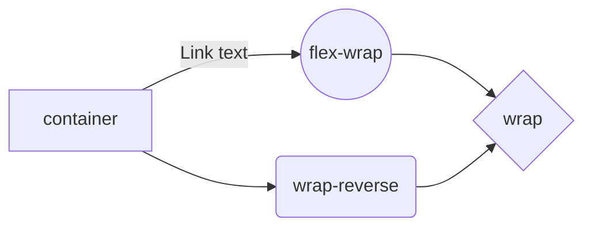

# # A Complete Guide to Flexbox!

Our comprehensive guide to CSS flexbox layout. This complete guide explains everything about flexbox, focusing on all the different possible properties for the parent element (the flex container) and the child elements (the flex items). It also includes history, demos, patterns, and a browser support chart.

# Flexbox properties
#### display

This defines a flex container; inline or block depending on the given value. It enables a flex context for all its direct children.**

## Properties for the Children  
(flex items)

By default, flex items are laid out in the source order. However, the `order` property controls the order in which they appear in the flex container.

### flex-grow

This defines the ability for a flex item to grow if necessary. It accepts a unitless value that serves as a proportion. It dictates what amount of the available space inside the flex container the item should take up.

If all items have  `flex-grow`  set to  `1`, the remaining space in the container will be distributed equally to all children. If one of the children has a value of  `2`, that child would take up twice as much of the space either one of the others (or it will try, at least).

